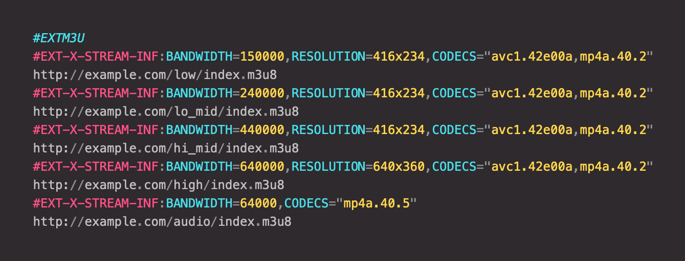

# prism-language-m3u

M3U language definition for syntax highlighting of [M3U and Extended M3U playlists](https://en.wikipedia.org/wiki/M3U) with [Prism](https://prismjs.com).

## Screenshot



## Usage

Load the language definition after Prism and define additional classes in your stylesheet if needed.

Usage with a bundler:

```console
# NPM
npm install prism-language-m3u
```

```js
import Prism from "prismjs";
import "prism-language-m3u";
```

Or the classic way:

```html
<script src="prism.js"></script>
<script src="prism-language-m3u.js"></script>
```

Sample markup:

```html
<pre><code class="language-m3u">#EXTM3U
#EXT-X-STREAM-INF:BANDWIDTH=150000,RESOLUTION=416x234,CODECS="avc1.42e00a,mp4a.40.2"
http://example.com/low/index.m3u8
#EXT-X-STREAM-INF:BANDWIDTH=240000,RESOLUTION=416x234,CODECS="avc1.42e00a,mp4a.40.2"
http://example.com/lo_mid/index.m3u8
#EXT-X-STREAM-INF:BANDWIDTH=440000,RESOLUTION=416x234,CODECS="avc1.42e00a,mp4a.40.2"
http://example.com/hi_mid/index.m3u8
#EXT-X-STREAM-INF:BANDWIDTH=640000,RESOLUTION=640x360,CODECS="avc1.42e00a,mp4a.40.2"
http://example.com/high/index.m3u8
#EXT-X-STREAM-INF:BANDWIDTH=64000,CODECS="mp4a.40.5"
http://example.com/audio/index.m3u8
</code></pre>
```
